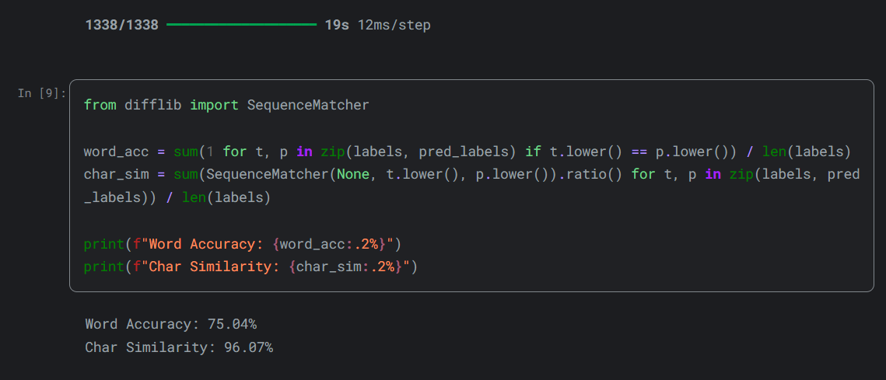

# Captcha Recognition

A deep learning-based captcha recognition project. It uses Convolutional Neural Networks (CNN), Transformer Self Attention and Connectionist Temporal Classification (CTC) decoding to capture the text in captcha image.

## Tech Stack


## Datasets
1. https://www.kaggle.com/datasets/parsasam/captcha-dataset
2. https://www.kaggle.com/datasets/fournierp/captcha-version-2-images
3. https://www.kaggle.com/datasets/mahmoudeldebase/captcha-numbers-length-6
4. https://www.kaggle.com/datasets/bharatnaik111/vtu-university-captchas-with-labels

## Model Architecture
```python
# CNN
inputs = layers.Input(shape=(HEIGHT, WIDTH, 1), name="image")

x = layers.Conv2D(64, (3, 3), activation="swish", padding="same", name="Conv1")(inputs)
x = layers.BatchNormalization()(x)
x = layers.MaxPooling2D((2, 2), name="pool1")(x)

x = layers.Conv2D(128, (3, 3), activation="swish", padding="same", name="Conv2")(x)
x = layers.BatchNormalization()(x)
x = layers.MaxPooling2D((2, 2), name="pool2")(x)

x = layers.Conv2D(256, (3, 3), activation="swish", padding="same", dilation_rate=2, name="Conv3")(x)
x = layers.BatchNormalization()(x)
x = layers.MaxPooling2D((2, 1), name="pool3")(x)

x = layers.Permute((2, 1, 3), name="permute")(x)
new_shape = (x.shape[1], x.shape[2] * x.shape[3])
x = layers.Reshape(target_shape=new_shape, name="reshape")(x)
```

```python
# projection and positional encoding
from tensorflow import constant

projection_dim = 128
x = layers.Dense(projection_dim)(x)

pos_indices = constant(np.arange(x.shape[1]).reshape((1, x.shape[1])) , dtype="int32")
pos_vectors = layers.Embedding(input_dim=x.shape[1], output_dim=projection_dim, name="pos_emb_layer")(pos_indices)
x = layers.Add(name="pos_add")([x, pos_vectors])
```

```python
# transformer / encoder / attention
for i in range(2):
    attn_out = layers.MultiHeadAttention(num_heads=8, key_dim=projection_dim, name=f"attn_{i}")(x, x)
    attn_out = layers.Dropout(0.1, name=f"attn_drop_{i}")(attn_out)
    x = layers.LayerNormalization(epsilon=1e-6, name=f"ln1_{i}")(x + attn_out)
    
    ffn_1 = layers.Dense(512, activation="relu", name=f"ffn1_{i}")(x)
    ffn_2 = layers.Dense(projection_dim, name=f"ffn2_{i}")(ffn_1)
    ffn_2 = layers.Dropout(0.1, name=f"ffn_drop_{i}")(ffn_2)
    x = layers.LayerNormalization(epsilon=1e-6, name=f"ln2_{i}")(x + ffn_2)


output = layers.Dense(num_classes + 1, activation="softmax", name="dense_output")(x)
base_model = models.Model(inputs=inputs, outputs=output, name="base_model")
```

## Accuracy



## Author
[](https://kaggle.com/krishnatherokar/)